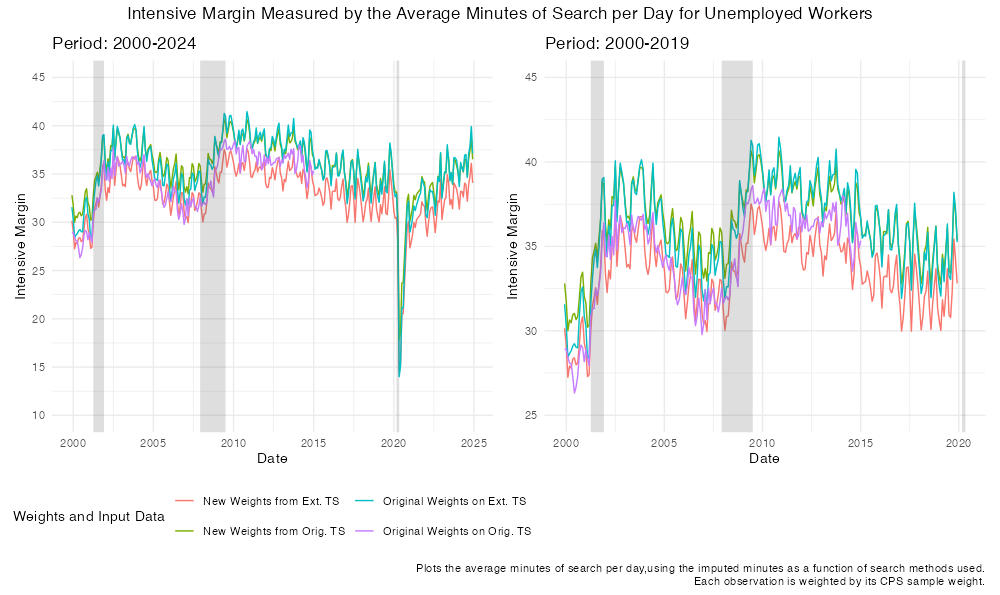

```{r setup, include=FALSE, message = FALSE}
knitr::opts_chunk$set(echo = FALSE, message = FALSE, warning = FALSE, cache = FALSE, fig.height = 6, fig.width = 8, dev = "ragg_png", dpi = 300)

library(tidyverse)
library(here)
library(janitor)
library(gridExtra)
library(MASS)
library(kableExtra)
library(knitr)
library(pdftools)
library(haven)
library(lubridate)
library(vctrs)
library(gets)
library(patchwork)
library(modelsummary)
library(conflicted)
source(here('code/formatting/plot_dicts.R'))
conflict_prefer_all("dplyr", quiet = TRUE)
conflicts_prefer(patchwork::area)

rename_fun <- function(x){
  return(str_to_title(gsub("_", " ", x)))
}

```


The model's central functionality relies on a variety of behavioural
mechanisms that are parametrised econometrically using micro data.
Furthermore, the model relies on additional sources of micro data for
validation. In the following section we outline, first, the data and
analysis used to derive the model's behavioral parameters, followed by
an inventory of the data used to validate various model outputs. We note
where we make use of methodology employed or constructed by other authors.
We conclude with an inventory of other data sources considered for
behavioral parameter calibration ultimately disregarded due to lack of
statistical power.

## Application Effort and Learning Dynamics: Applications Sent {.tabset}

First, we employ data from the US Bureau of Labor Statistics and the Curren Population Survey on the application effort of unemployed job-seekers to discipline our behavioral mechanism for search. More specifically, in 2018 (May, September) and 2020 (February, May), the Bureau of Labor
Statistics ran the "Unemployment Insurance Nonfilers" supplemental
survey to the monthly Current Population Survey run by the US Census
Bureau. The survey's stated intent was to "obtain information on the
characteristics of people who do not file for Unemployment Insurance
benefits as well as their reasons for not doing so." The survey was
conducted for all persons responding the the monthly Current Population
Survey which encompasses "all persons in the civilian non-institutional
population of the United States living in households. The probability
sample selected to represent the universe consists of approximately
54,000 households."

Relevant to our work, survey respondents were asked the following two questions:


### Overview of Survey Results

First, we replicate figures produced for a 2020 Bureau of Labor Statistics "Beyond the Numbers" issue 2020 ["Beyond the Numbers"
issue](https://www.bls.gov/opub/btn/volume-9/how-do-jobseekers-search-for-jobs.htm#_edn5), illustrating some high-level results from the survey, prior to describing the econometric specifications employed using the raw survey data. As seen in the image above, the survey responses regarding applications sent are "binned" into intervals (ie. number of people sending 81 or more applications or unemployment duration of
between 5 and 14 weeks) which means that any line plots (or linear
interpretation of the bar graph) should be done with caution.

In Figure 1, the top left panel shows the proportion of all individuals sending X amount of applications receiving Y amount of interviews. The plot indicates a "consistent" return to sending more applications, although as demonstrated in the bottom left plot, the number of applications sent is not a linear predictor of job offers received. More precisely, the bottom left plot demonstrates that the percentage of jobseekers receiving an offer seems to increase as a function of the number of applications sent, until a certain point.Next, the right plot demonstrates the number of applications sent (red), interviews received (green), average interview:application ratio (blue), and probability of receiving a job offer (purple) by individuals in each category of unemployment duration. There is some indication that both effort and success seem to increase and then decline with time spent in unemployment, apart from success as measured by receiving a job offer which seems to consistently decline with time spent in unemployment.

```{r cpssupp1, echo = FALSE, include = TRUE, cache = TRUE, echo = FALSE, messages = FALSE, warning=FALSE, fig.cap = "Replication of BLS Analysis", cache = TRUE}

source(here('data/ATUS/cps_2018_supplement.R')) # CHECKED, no plots needing common theme
wrap_width = 40

names(file_tables) <- table_titles

temp <- file_tables[[1]]

names(temp) <- temp[1,]
temp <- temp[-1,] %>%
  clean_names %>%
  select(-c(na, total)) %>%
  slice(-n()) %>%
  mutate(across(starts_with("x"), as.numeric))

# Gather the data into long format for ggplot
df_long <- temp %>%
  gather(key = interviews, value = "Proportion", -applications) %>%
  mutate(Proportion = Proportion/100,
         interviews = gsub("x", "", gsub("_", " ", interviews)))

# Create the heatmap plot using ggplot
p1 <- ggplot(df_long, aes(y = interviews, x = applications, fill = Proportion)) +
  geom_tile() +
  scale_fill_gradient(low = "white", high = "blue") +  # Customize color gradient
  labs(title = str_wrap(paste0(sub(", 2018", "", sub("^Table\\s+\\d+\\.\\s*", "", names(file_tables[1])))), wrap_width), x = "Number of Applications Sent", y = "Interviews Received",
       caption = str_wrap("Shading indicates the proportion of people\nsending X applications receiving Y interviews.", wrap_width)) +
  theme_minimal() +
  theme(axis.text.x = element_text(angle = 45, hjust = 1),
          plot.title = element_text(size = 8)) +
  common_theme


job_finding_rate <- file_tables[[5]] %>%
  slice(-n()) %>%
  clean_names()

search_effort <- file_tables[[2]] %>%
  slice(-n()) %>%
  clean_names() %>%
  left_join(., job_finding_rate, by = "duration_of_unemployment") %>%
  mutate(duration = row_number(),
         across(2:5, as.numeric),
         probability_of_receiving_job_offer = probability_of_receiving_job_offer/100) %>%
  pivot_longer(!c(duration_of_unemployment, duration)) %>%
  mutate(name = factor(name, levels = c("average_number_of_applications",
                                        "average_number_of_interviews",
                                        "average_interview_to_application_ratio",
                                        "probability_of_receiving_job_offer")))

p2 <- ggplot() +
  geom_line(data = filter(search_effort, duration != 1),
            aes(x = duration, y = value, colour = name)) +
  scale_x_continuous(breaks =2:5,
    labels = c("Less than 5 weeks", "5 to 14 weeks", "15 to 26 weeks", "27 weeks and over")) +
  labs(title = str_wrap(paste0(sub(", 2018", "", sub("^Table\\s+\\d+\\.\\s*", "", names(file_tables[2])))), wrap_width), x = "Unemployment Duration", y = "") +
  facet_wrap(~name, scales = "free_y", ncol = 1, labeller = labeller(name = rename_fun)) +
    theme(axis.text.x=element_text(angle=90),
          legend.position = "none",
          plot.title = element_text(size = 8)) +
  common_theme


job_offer_rate_apps <- file_tables[[3]] %>%
  slice(-n()) %>%
  clean_names() %>%
  mutate(applications = factor(applications, levels = c("All jobseekers", "0", "1 to 10", "11 to 20", "21 to 80", "81 or more")),
         probability_of_receiving_job_offer = as.numeric(probability_of_receiving_job_offer))

p3 <- ggplot() +
  geom_bar(data = filter(job_offer_rate_apps, applications != "All jobseekers"),
            aes(x = applications, y = probability_of_receiving_job_offer), fill = "coral2", stat = "identity", width = 0.5) +
  labs(title = str_wrap(paste0(sub(", 2018", "", sub("^Table\\s+\\d+\\.\\s*", "", names(file_tables[3])))), wrap_width),
       x = "Number of applications sent",
       y = "Probability of receiving a job offer") +
  scale_y_continuous(limits = c(0,40)) +
  theme(plot.title = element_text(size = 8)) +
  common_theme


# Compile all plots
grid.arrange(p1, p2, p3, layout_matrix = rbind(
    c(1, 2), # Plot 1 (left column, top row), Plot 3 (right column)
    c(3, 2)  # Plot 2 (left column, bottom row), Plot 3 (right column)
  ))

```

### Econometric Specification Using Raw Data

```{r cps_supp2, echo=FALSE, fig.height = 7, fig.width = 10, cache = TRUE}
source(here('data/behav_params/CPS_BLS_Supplement_18_22/cps_bls_supp_cleaning.R')) # CHECKED, no ggplot objects need common_theme

bea_temp <- bea_2022 %>%
  select(HRHHID, PEA1, PRUNEDUR, HEFAMINC, PESEX, PTDTRACE, PRDTOCC1, PEEDUCA, PESEX, PRTAGE) %>%
  mutate(year = 2022) %>%
  rbind(., select(mutate(bea_2018, year = 2018), HRHHID, PEA1, PRUNEDUR, HEFAMINC, PESEX, PTDTRACE, PRDTOCC1, PEEDUCA, PESEX, PRTAGE, year)) %>%
  mutate(year = as.factor(year)) %>%
  filter(PEA1 >= 0 & PRUNEDUR > 0) %>%
  mutate(PEA1 = factor(PEA1, levels = c(0,1,2,3,4),
                       labels = c("0",
                                  "1 to 10",
                                  "11 to 20",
                                  "21 to 80",
                                  "81 or more")),
         PRUNEDUR_brackets = case_when(PRUNEDUR < 5 ~ "<5 weeks",
                                       PRUNEDUR >= 5 & PRUNEDUR <= 14 ~ "05-14 weeks",
                                       PRUNEDUR > 14 & PRUNEDUR <= 26 ~ "15-26 weeks",
                                       PRUNEDUR > 26 ~ "27 weeks+"),
         PRUNEDUR2 = PRUNEDUR^2,
         PRUNEDUR_MO = floor(PRUNEDUR/4),
         PRUNEDUR_MO2 = PRUNEDUR_MO^2,
         white = as.numeric(PTDTRACE == 1),
         black = as.numeric(PTDTRACE == 2),
         asian = as.numeric(PTDTRACE == 4),
         female = as.numeric(PESEX == 2),
         no_hs = as.numeric(PEEDUCA < 39),
         hs_no_bachelors = as.numeric(PEEDUCA >= 39 & PEEDUCA <= 42),
         bachelors_plus = as.numeric(PEEDUCA > 42),
         age_29_less = as.numeric(PRTAGE < 30),
         age_30_39 = as.numeric(PRTAGE >= 30 & PRTAGE < 40),
         age_40_54 = as.numeric(PRTAGE >= 40 & PRTAGE < 55),
         age_54_64 =  as.numeric(PRTAGE >= 55 & PRTAGE < 65),
         age_65_plus =  as.numeric(PRTAGE >= 65)) %>%
  group_by(year, PRUNEDUR_brackets) %>%
  mutate(mean_inc = mean(HEFAMINC)) %>%
  ungroup

bea_temp %>%
  ggplot() +
  geom_jitter(aes(x= PRUNEDUR, y = PEA1, colour = year)) +
  labs(x = "Unemployment Duration (Weeks)", y = "Number of applications sent in the last two months",
       title = "Applications sent vs. Time Spent Unemployed: 2022 & 2018",
       subtitle = "Grey gridlines align with 2-month/8-week intervals. N = 2,896 (2018) & 1,677 (2022)",
       color = "Year") +
   theme(panel.grid.minor = element_line(colour="grey", linetype = "dashed"),
         panel.grid.major = element_blank()) +
 scale_x_continuous(minor_breaks = seq(0, 120, 8)) +
  scale_color_manual(values = c("darkblue", "steelblue")) +
  common_theme

# bea_temp %>%
#   ggplot() +
#   geom_density(aes(x = HEFAMINC, fill = PRUNEDUR_brackets), alpha = 0.5) +
#   labs(x = "Income Bracket", y = "Count",
#        title = "Histogram of Income by Unemployment Duration")
# 
# bea_temp %>%
#   ggplot() +
#   geom_violin(aes(x = PRUNEDUR_brackets, y = HEFAMINC, fill = PRUNEDUR_brackets), alpha = 0.5) +
#   labs(x = "Unemployment Duration", y = "Income Bracket",
#        title = "Distribution of Family Income by Unemployment Duration")

```

To inform our agent behavior, we derive an unemployment-duration dependent measure of application effort, reporting in applications sent. More precisely, we estimate the probability distribution over reported job application intensity during unemployment using pooled micro data from the 2018 and 2022 waves of the CPS in which the Bureau of Labor Statistics conducted a Job Search Supplement. The survey asks unemployed respondents who are actively searching for work the amount of job applications they have sent. Respondents report job application counts in ordinal bins: ``0'', ``1–10'', ``11–20'', ``21–80'', and ``81 or more''. To account for the lack of a continuous dependent variable, we estimate a series of ordinal logistic regression models to recover the conditional probability of each response bin as a function of unemployment duration and various demographic characteristics. We test model specifications along three dimensions: (i) link function, comparing logistic, probit, complementary log-log (cloglog), and log-log links; (ii) linear, quadratic, and cubic specifications of unemployment duration; and (iii) models with and without demographic covariates (education, gender, age, and family income; race was excluded due to lack of statistical significance across models). Formally, the model estimates $\Pr(Y_i \leq j \mid X_i)$, the cumulative probability of observing response category $Y_i$ for individual $i$ below $j$ where $j$ represents the five ordinal bins given various transformations of the vector $X_i$ of independent variables (unemployment duration and demographic controls).

Below, we display the results of an exploration of the probability of
reporting a specific number of applications sent (in the bins as in the
survey question above) using various specifications of an ordinal
logistic regression. Wetest specifications varying three different model
parameters:\
1. link function\
2. linear vs. quadratic unemploymentduration,\
3. with and without demographic control variables (education, gender,
age, family income - race excluded because of lack of statistical
significance though this can be revisited.)

We estimate an ordinal logistic regression model for reported
applications sent $Y_i$ in ${0, 1, 2, 3, 4}$ testing four different link
functions: the complementary log-log (cloglog), logistic, log-log, and
probit link functions. Let $X_i^\top \beta$ denote the predictor
variable. The cumulative probability of observing response category $j$
or below, $\Pr(Y_i \leq j \mid X_i)$, is modeled as follows for each
link function:

\begin{align*}
\text{Complementary log-log (cloglog):} \quad & \Pr(Y_i \leq j \mid X_i) = 1 - \exp\left( -\exp\left( \tau_j - X_i^\top \beta \right) \right) \\
\text{Logistic (logit):} \quad & \Pr(Y_i \leq j \mid X_i) = \frac{1}{1 + \exp\left( -(\tau_j - X_i^\top \beta) \right)} \\
\text{Loglog:} \quad & \Pr(Y_i \leq j \mid X_i) = \exp\left( -\exp\left( -(\tau_j - X_i^\top \beta) \right) \right) \\
\text{Probit:} \quad & \Pr(Y_i \leq j \mid X_i) = \Phi(\tau_j - X_i^\top \beta)
\end{align*}

Here, $\Phi(\cdot)$ denotes the cumulative distribution function of the
standard normal distribution. The estimated coefficients $\beta$ are
interpreted conditional on the choice of link function where $X_i$ is
either:

$X_i = \left( \text{Unemp.Dur.}_i \right)$

$X_i = \left( \text{Unemp.Dur.}_i^2 \right)$

$X_i = \left( \text{Unemp.Dur.}_i, \text{Unemp.Dur.}_i^2 \right)$

with and without control variables (education, gender, age, family
income).

Assumptions about the probability distribution of the errors associated
with each link function:\
- *Logit:* Useful when responses are evenly distributed across
categories.\
- *Probit:* Useful when latent variable is assumed to be normally
distributed.\
- *Complementary log-log:* Useful when higher categories are more
probable.\
- *Log-log:* When early categories are of more importance or more
probable.

```{r cps_supp3, echo=FALSE, fig.height = 6, fig.width = 10, cache = TRUE}

bea_temp <- bea_temp %>% 
  mutate(PEA_fct = case_when(PEA1 == "0" ~ 0,
                   PEA1 == "1 to 10" ~ 1,
                   PEA1 == "11 to 20" ~ 2, 
                   PEA1 == "21 to 80" ~ 3,
                   PEA1 == "81 or more" ~ 4)) 

bea_temp$PEA_fct <- ordered(
  bea_temp$PEA1, 
  levels = c("0", "1 to 10", "11 to 20", "21 to 80", "81 or more")
)

control_vars <- c("female", "no_hs", "hs_no_bachelors",
                  "age_29_less", "age_30_39", "age_40_54", "age_54_64", "HEFAMINC")

link_methods <- c("logistic", "probit", "cloglog", "loglog")
control_statuses <- c("no_controls", "with_controls")

plots_final <- list()
# Store AICs
aic_results <- data.frame()

for (mod in c("PRUNEDUR_MO", "PRUNEDUR_MO2", "PRUNEDUR_MO + PRUNEDUR_MO2")) {
  
  if(mod == "PRUNEDUR_MO"){
    title_mod <- bquote(X[i] == (Unemp.Dur.[i]))
  }else if(mod == "PRUNEDUR_MO2"){
    title_mod <- bquote(X[i] == (Unemp.Dur.[i]^2))
  }else if(mod == "PRUNEDUR_MO + PRUNEDUR_MO2"){
    title_mod <- bquote(X[i] == (Unemp.Dur.[i] * "," ~ Unemp.Dur.[i]^2))
  }else{
    title_mod <- mod
  }
  
  combined_data <- data.frame()
  
  for (method in link_methods) {
    for (control_status in control_statuses) {
      
      # Model formula
      formula_str <- if (control_status == "with_controls") {
        paste0("PEA_fct ~ ", mod, " + ", paste(control_vars, collapse = " + "))
      } else {
        paste0("PEA_fct ~ ", mod)
      }
      
      # Fit model
      model <- polr(
        as.formula(formula_str),
        data = bea_temp,
        method = method,
        Hess = TRUE
      )
      
      aic_results <- rbind(aic_results, tibble(
        Duration_Var = mod,
        Method = method,
        Controls = ifelse(control_status == "with_controls", "With Controls", "No Controls"),
        AIC = AIC(model),
        mod_res = list(model)
      ))
      
      # Prediction data
      new_data <- data.frame(PRUNEDUR_MO = seq(
        min(bea_temp$PRUNEDUR_MO, na.rm = TRUE),
        max(bea_temp$PRUNEDUR_MO, na.rm = TRUE),
        length.out = 100
      ))
      
      if (mod != "PRUNEDUR_MO") {
        new_data$PRUNEDUR_MO2 <- new_data$PRUNEDUR_MO^2
      }
      
      # Add average control values
      for (var in control_vars) {
        new_data[[var]] <- mean(bea_temp[[var]], na.rm = TRUE)
      }
      
      # Predict
      probs <- predict(model, newdata = new_data, type = "probs")
      
      # Format
      probs_long <- new_data %>%
        select(PRUNEDUR_MO) %>%
        bind_cols(as.data.frame(probs)) %>%
        pivot_longer(cols = -PRUNEDUR_MO, names_to = "Category", values_to = "Probability") %>%
        mutate(
          Method = method,
          Controls = ifelse(control_status == "with_controls", "With Controls", "No Controls")
        )
      
      combined_data <- bind_rows(combined_data, probs_long)
    }
  }
  
  # Create the plot with facet by control setting (2 subplots), within each facet multiple methods
  p <- ggplot(combined_data, aes(x = PRUNEDUR_MO, y = Probability, color = Method)) +
    geom_line(size = 0.9) +
    facet_grid(Category ~ Controls, scales = "free_y") +
    labs(
      title = bquote("Predicted Application Probabilities" ~ .(title_mod)),
      x = "Unemployment Duration (Months)",
      y = "Predicted Probability",
      color = "Link Function"
    ) +
    theme_minimal() +
    theme(legend.position = "bottom")+
  common_theme

  plots_final[[mod]] <- p
}
# View plot for PRUNEDUR_MO
print(plots_final[["PRUNEDUR_MO"]])

# View plot for PRUNEDUR_MO2
print(plots_final[["PRUNEDUR_MO2"]])

# View plot for PRUNEDUR_MO2
print(plots_final[["PRUNEDUR_MO + PRUNEDUR_MO2"]])
```

Using an AIC information criterion to compare the fit across all models,
clear results emerge. Models including socio-demographic controls consistently outperform unadjusted models (blue versus red dots in the figure below) and the inclusion of a quadratic transformation (labelled "Lin-Quadratic" in the plot below) of unemployment duration better captures the non-linear relationship between unemployment duration and application effort. Among link functions, the complementary log-log specification performs best across model comparisons. Though the logistic link function emerges as slightly superior in the specification incorporating a linear and quadratic term, we choose to employ the complementary log-log link function to align with the hypothesis that fine-grained resolution is needed among low application effort categories, which dominate the data. Thus, employing a complementary log-log link function, quadratic unemployment duration, and full demographic controls, we generate predicted probabilities over the five application bins for unemployment spells ranging from 0 to 36 months. These fitted probabilities serve as the empirical foundation for modeling job search effort in the agent-based simulation. In our chosen specification, the odds of reporting a lower application bin increase by approximately 0.1\% per additional month unemployed, a relationship statistically significant at the 0.1\% level. However, the inclusion of a quadratic term allows for a concave shape to emerge, better fitting the non-linearity of this relationship between unemployment duration and applications sent.

```{r cps_supp4, echo=FALSE, fig.height = 6, fig.width = 8, cache = TRUE}
# Normalize AIC relative to the best within each duration variable
aic_results <- aic_results %>%
  #group_by(Duration_Var) %>%
  mutate(Relative_AIC = AIC - min(AIC)) %>%
  ungroup() %>% 
  mutate(duration = case_when(Duration_Var == "PRUNEDUR_MO" ~ "Linear",
                   Duration_Var == "PRUNEDUR_MO2" ~ "Quadratic",
                   Duration_Var == "PRUNEDUR_MO + PRUNEDUR_MO2" ~ "Lin-Quadratic"))

ggplot(aic_results, aes(x = Relative_AIC, color = Controls, shape = Method, y = duration)) +
  geom_point(size = 4) + #stat = "identity", position = position_dodge(width = 0.8)) +
  #facet_wrap(~Duration_Var) +
  labs(
    title = "Relative AIC Across Link Functions and Linear vs. Quadratic Unemployment Duration",
    x = "Relative AIC (compared to best-fit model)",
    y = "w. or w.o Controls",
    color = "Link Function",
    shape = "Transformation of Unemp. Dur."
  ) +
  theme_minimal() +
  theme(axis.text.x = element_text(angle = 45, hjust = 1))+
  common_theme
```

The figure below demonstrates the predicted probability distribution of application effort by unemployment duration indicating a non-linear concave search effort. We believe this contributes to an open debate in the job search literature regarding the shape of search effort over the unemployment spell. The concave application effort emerging from this data aligns with previous observations about unemployed workers engaging in delayed search while either grieving job loss or engaging in job search planning and adjusting expectations about their re-employment prospects, as described in the main text.

The final result is that for each additional quarter of unemployment, an individual’s
odds of dropping to a lower-level application category decreases by
\~.1%. This is statistically significant across all specifications at
the 0.1% level.

```{r, echo=FALSE, fig.height = 8, fig.width = 10, cache = FALSE}
# View best model row
best_row <- aic_results %>% arrange(AIC) %>% slice(1)

# Access the stored model object
best_model <- best_row$mod_res[[1]]

create_data <- function(length = NULL){
  if(is.null(length)){
    # Prediction data
      dat <- data.frame(PRUNEDUR_MO = seq(
        min(bea_temp$PRUNEDUR_MO, na.rm = TRUE),
        max(bea_temp$PRUNEDUR_MO, na.rm = TRUE),
        length.out = max(bea_temp$PRUNEDUR_MO, na.rm = TRUE) + 1
    ))
  }else{
        # Prediction data
      dat <- data.frame(PRUNEDUR_MO = seq(
        min(bea_temp$PRUNEDUR_MO, na.rm = TRUE),
        length,
        length.out = length + 1))
  }
  
  dat$PRUNEDUR_MO2 <- dat$PRUNEDUR_MO^2
  
  # Add average control values
  for (var in control_vars) {
    dat[[var]] <- mean(bea_temp[[var]], na.rm = TRUE)
  }
  
  # Predict
  probs <- predict(best_model, newdata = dat, type = "probs") 
  
  dat <- dat %>% 
      select(PRUNEDUR_MO) %>%
            bind_cols(as.data.frame(probs)) %>%
            pivot_longer(cols = -PRUNEDUR_MO, names_to = "Category", values_to = "Probability") 

  return(dat)
}

new_data <- create_data()
new_data_long <- create_data(200)

stopifnot(identical(new_data, slice(new_data_long, 1:nrow(new_data))))
stopifnot(all.equal(new_data, mutate(tibble(read.csv(here("data/behav_params/CPS_BLS_Supplement_18_22/app_probs.csv"))[,-1]), PRUNEDUR_MO = as.numeric(PRUNEDUR_MO))))


limits_df <- new_data %>%
  group_by(Category) %>%
  summarise(
    center = mean(Probability),
    range = max(Probability) - min(Probability),
    width = 0.12  # or use: range * 1.2
  ) %>%
  mutate(
    y_min = pmax(0, center - width / 2),
    y_max = pmin(1, center + width / 2)
  )

# Merge limits into the plot data
plot_data <- left_join(new_data, limits_df, by = "Category")
plots <- plot_data %>%
  split(.$Category) %>%
  lapply(function(df_cat) {
    ggplot(df_cat, aes(x = PRUNEDUR_MO, y = Probability)) +
      geom_line(size = 0.9, color = "darkgrey") +
      labs(title = paste0("Sent ", unique(df_cat$Category), " applications"), x = "Unemployment Duration (Months)") +
      coord_cartesian(ylim = c(unique(df_cat$y_min), unique(df_cat$y_max))) +
      theme_minimal() +
      theme(
        plot.title = element_text(size = 10, face = "bold"),
        axis.title.y = element_blank()
      ) +
  common_theme
  })

p1 <- wrap_plots(plots, ncol = 1) +
  plot_annotation(
    title = "Predicted Application Probabilities (Manually Normalized Y-Axis Ranges)",
    theme = plot_annotation_theme
  ) 
  
p2 <- new_data %>% 
    ggplot(aes(x = PRUNEDUR_MO, y = Probability, fill = Category)) +
    geom_area(stat = "identity") +
    scale_fill_brewer(palette = "Set2") +
    labs(y = "Probability of Sending X Applications (Binned)", x = "Unemployment Duration (Months)", title= paste0("Predicted Probabilities of Apps Sent\nby Unemployment Duration"))+
  common_theme 


p_all <- (p1 | p2) + plot_annotation(title = "Predicted Probabilities of Application Effort by Unemployment Duration",
      subtitle = "N = 5,169\nBureau of Labor Statistics Data reported in 2018 and 2022.\nEstimated using an ordinal logistic regression in which the outcome variables are bins of applications sent.\nUnemployment duration enters quadratically w. socio-demographic controls.\nControls: Education, Age, Gender, Family Income. Race excluded because of lack of statistical significance.\nLink function: Complementary log-log function selected using AIC comparison on 4 alternative link functions.",  theme = plot_annotation_theme
      )

p_all

ggsave(here("data/figures/application_effort.png"))

# new_data %>% 
#   write.csv(., here("data/behav_params/CPS_BLS_Supplement_18_22/app_probs.csv"))

# new_data_long %>%
#   write.csv(., here("data/behav_params/CPS_BLS_Supplement_18_22/app_probs_long.csv"))

```

## Wage Expectations and Satisficing: Reservation Wage Adjustment

As part of the Current Population Survey, the US Census Bureau conducts an annual Displaced Worker Supplement in which workers who have lost their job in the last three years are asked additional questions about their unemployment experiences and (if re-employed) their re-employment conditions. From this we draw a reservation wage adjustment rate as a function of unemployment duration. We compare various econometric specifications across several samples that correct for selection effects that typically confound studies of duration-dependent employment outcomes. 

<!-- CHECKED FOR COMMON THEME NEEDS -->

```{r cps_disc_vignette_input, child = "cps_displaced_worker_supplement/cps_disc_worker_vignette.Rmd"}
```

## OTJ Search Propensity

A key improvement in this model is the incorporation of on-the-job seekers. Eeckhout et al. 2019 demonstrate that the flow of employed job-seekers into the pool of job-seekers can generate increased competition in boom periods. Therefore, we triangulate a mean value for the propensity of employed job-seekers to engage in search using the methodology and data presented in Eeckhout et al. 2019. In other words, we derive the sensitivity of employed job seekers to the business cycle from the employment-to-employment transitions data as used in Eeckhout et al. Due to unreliable component parts of the Eeckhout analysis, we decided to abandon using their estimated parameters (search intensity for employed workers), and instead rely on their series of the 


3.  [Eeckhout et al. 2019 Unemployment
    Cycles](https://www.aeaweb.org/articles?id=10.1257/mac.20180105): 

```{r eeckhout, echo = FALSE, fig.height = 8, fig.width = 10, cache = TRUE, results = 'asis'}

source(here('data/behav_params/Eeckhout_Replication/eeckhout_extended_replication.R'))

```

## Supporting Data for Validation

### Intensive Search Effort: Mukoyama et al. 2018 *Job Search and the Business Cycle*

We use evidence from [Mukoyama et al. 2018](https://www.aeaweb.org/articles?id=10.1257/mac.20160202) regarding the cyclicality of unemployed job search effort to validate the micro behaviour of our
agents. This is a foundational paper within the literature that explores the relationship between search effort and business cycles. The authors provide new data on the intensive margin of unemployed search effort (in minutes searched) over the business cycle by linking date from the American Time Use Survey (ATUS) and Current Population Survey (CPS). We employ the methods and data presented in their work in a validation exercise of the emergent micro behavior of unemployed job-seekers. 

More specifically, the authors provide a novel measure of job search effort exploiting the American Time Use and Current Population Surveys which can be reduced to
just the intensive margin (changes in search effort by worker). Typically, this is an extremely challenging measure to approximate due to data availability and survey design. In general, surveys measure actions taken (i.e., applications sent, interviews completed) but these indicators can abstract from the fundamental intensive margin of search effort. In other words, the most common metrics that measure search effort can result from passive search or intrinsic advantageous worker characteristics, obscuring any sense of real search "effort" or urgency with which individuals apply their search strategies. This intensive margin underlies the motivation behind our dynamic search effort rule, making this data a valuable source of validation data for the model's output. 

Methodologically, the authors construct this time series measure of job search intensity by linking the American Time Use Survey (ATUS) and Current Population Survey (CPS). While the ATUS directly measures minutes spent on job search activities but has limited sample size and coverage (2003-2014), the CPS reports the number and types of search methods used over larger samples beginning in 1994. Both surveys ask similar questions about search methods employed in the previous month. The authors exploit this overlap by first estimating the relationship between reported search time and search methods in the ATUS using a Heckman selection model—estimating both the probability of positive search time and the number of minutes conditional on searching, controlling for demographics, occupation, and unemployment duration. They then apply these estimated coefficients to impute daily search time for all CPS unemployed respondents based on their reported search methods, generating a monthly intensive margin series from 1994-2014. This approach weights each search method by its estimated time intensity and allows baseline search effort to vary by demographic characteristics, producing a more nuanced measure than simply counting the number of methods used.

The figure below represents the intensive search margin time series as calculated by the authors. This data is drawn from the replication code provided by the authors. We have translated the code from Stata to R, and the time series represented in the figure below relies on the methodology outlined by Mukoyama et al. We indicate in the caption and legend where we have incorporated new data by extending the time series to include additional years or applied an alternative weighting scheme to the data to account for missing data. The citation for this work can be found in the bibliography of the main text.



```{r mukoyama, echo = FALSE, include = FALSE, fig.height = 8, fig.width = 10}

source(here("data/behav_params/Mukoyama_Replication/mukoyama_replication_analysis.R"))

```


### Learning Rate - Mueller et al. Job Seekers' Perceptions and Employment Prospects: Heterogeneity, Duration Dependence and Bias {.tabset}

[Mueller et al: Job Seekers' Perceptions and Employment
Prospects](https://www.aeaweb.org/articles?id=10.1257/aer.20190808)

5.  [**Mueller et al. 2021: Job Seekers' Perceptions and Employment
    Prospects: Heterogeneity, Duration Dependence and
    Bias**](https://www.aeaweb.org/articles?id=10.1257/aer.20190808)

*The authors claim to disentangle the effects of duration dependence and
dynamic selection by using job seekers' elicited beliefs about
job-finding. Assuming (and confirming empirically) that job-seekers have
realistic initial beliefs about job-finding they isolate the
heterogeneity in job-seekers from true duration dependence. Ultimately,
they find that dynamic selection selection explains most of the negative
duration dependence (rather than pure, true duration dependence).*

*Findings: Results are remarkably consistent even when including
additional data from 2019-2024.* The below results replicate the
findings in Mueller et al and extend the analysis to include a longer
time series. Plot and regression table titles have been maintained for
easy comparison.

We aim to include this information in our theoretical model of the job
search effort as a learning rate (ie. individuals learn about their
re-employment probability with repeated failures in the job search).

```{r mueller, echo = FALSE, fig.height = 8, fig.width = 10, cache = FALSE, results = 'asis'}

source(here("data/behav_params/Mueller_Replication/mueller_repl_analysis_extended_samples.R"))

```

## Additional Analyses {.tabset}

<!-- Wefirst focus on replicating and extending the empirical analysis that speaks to the three determinants above (dynamic selection, duration dependence, search effort) -->

<!-- 3. (Forthcoming) **[Kroft et al. 2016: Long-Term Unemployment and the Great Recession: The Role of Composition, Duration Dependence, and Nonparticipation](https://www.jstor.org/stable/26588430)** -->

<!-- *Abstract: We explore the role of composition, duration dependence, and labor force nonparticipation in accounting for the sharp increase in the incidence of long-term unemployment (LTU) during the Great Recession. We show that compositional shifts account for very little of the observed increase in LTU. Using panel data from the Current Population Survey for 2002–7, we calibrate a matching model that allows for duration dependence in unemployment and transitions between employment, unemployment, and nonpartici- pation. The calibrated model accounts for almost all of the increase in LTU and much of the observed outward shift in the Beveridge curve between 2008 and 2013.* -->

### SCE Labor Market Survey: Reservation Wages

**Survey of Consumer Expectations Reservation Wages, Accepted Wages, and
Wage Expectations** The data is unfortunately sparse and linking
outcomes to reservation wages is difficult which is why this data was ultimately excluded from the analysis in the main text. However, in a
cross-sectional setting we are able to deduce some weak relationships
between Unemployment Duration and Absolute Reservation Wages and Wage
Expectations. These relationships weakly support the deduced negative relationship between unemployment duration and reservation wages found using the Displaced Worker Supplement of the Current Population Survey, as described above.

Exploring the effect of unemployment duration on reservation wages,
accepted wages, and expected wage offers.

```{r sce_res_wage, fig.height = 8, fig.width = 10, results = 'asis'}

source(here("data/behav_params/SCE Labour Market Survey/sce_res_wage_analysis.R"))

```

<!-- ## Kroft et al. Long-Term Unemployment and the Great Recession: The Role of Composition, Duration Dependence, and Nonparticipation -->

<!-- [Kroft et al. Long-Term Unemployment and the Great Recession](https://www.jstor.org/stable/26588430) -->

<!-- ```{r, echo = FALSE} -->

<!-- ``` -->

<!-- ## Own work on microdata... {.tabset} -->

### SCE Job Search Supplement

The Federal Reserve Bank of New York compiles the nationally
representative Survey on Consumer Expectations annually in October.
Since 2013, they have run a Job Search Supplement which includes
questions on the time spent searching for work, and unemployment
duration. The job search supplement's questions are listed 
[here](https://www.newyorkfed.org/medialibrary/Interactives/sce/sce/downloads/data/SCE-Labor-Market-Survey-Data-Codebook.pdf?sc_lang=en).
Below, we plot the relationship between time spent searching and time
out of work. The table below also indicates the number of people
unemployed in the dataset and the number of people unemployed and
searching.

```{r sce_job_search1, echo=FALSE, results = 'asis', cache = FALSE}

source(here('data/behav_params/SCE Job Search Survey/sce_job_search_cleaning.R'))

# Extract question types
categories <- sce_job_search_full %>%
  names %>%
  grep("[0-9]", ., value = TRUE) %>%
  lapply(., function(x) str_split_i(x, "(?=\\d)", i = 1)) %>%
  unlist %>%
  unique %>%
  grep("under", ., value = TRUE, invert = TRUE)

codebook <- pdf_text(here('data/behav_params/SCE Job Search Survey/SCE-Labor-Market-Survey-Data-Codebook.pdf')) %>%
  lapply(., function(x) str_split(x, "\n")) %>%
  unlist %>%
  .[.!="" & !grepl("                                                      ", .)]

# Creates list of categories of questions in job search survey
labels = list("l" = "GENERAL LABOR MARKET QUESTIONS",
              "jh" = "JOB SEARCH FOR MOST RECENT JOB",
              "ec" = "ADDITIONAL EMPLOYMENT INFORMATION",
              "es" = "ADDITIONAL INFORMATION FOR THE SELF EMPLOYED",
              "eo" = "ADDITIONAL INFORMATION FOR THE NON-EMPLOYED",
              "el" = "ADDITIONAL INFORMATION ON THE MOST RECENT JOB",
              "js" = "JOB SEARCH BEHAVIOR",
              "rw" = "RESERVATION WAGE ELICITATION",
              "tp" = "BENEFITS AND TRANSFER PAYMENTS HISTORY",
              "hh" = "SPOUSE/PARTNER EMPLOYMENT STATUS")

# Split the codebook based on the 10 higher-level categories present in the Job Search Survey
list_splitters <- lapply(categories, toupper) %>% unlist %>% paste0(., ". ", labels)
is_start <- codebook %in% list_splitters
group_index <- cumsum(is_start)

# Split the list into sublists based on the grouping index
sublists <- split(codebook, group_index)


```

```{r sce_job_search2, echo=FALSE, cache = FALSE}

library(ggbreak)

sce_job_search_free <- sce_job_search %>%
  select(responseid,
         year,
         l7_days_spent_searching,
         l7_days_spent_searching_transformed,
         l8_months_no_work) %>%
   # Removes one extreme outlier at 600
  filter(l8_months_no_work < 400,
         l7_days_spent_searching_transformed < 2000)


sce_job_search %>%
  group_by(year) %>%
  summarise(n_obs_unemployed = n()) %>%
  left_join(., summarise(group_by(sce_job_search_free, year), n_obs_unemp_searching = n()), by = "year") %>%
  rename('Year' = year,
         'N Unemployed' = n_obs_unemployed,
         'N Unemp & Searching' = n_obs_unemp_searching) %>%
  kable()

sce_job_search_free %>%
    pivot_longer(!c(responseid, year)) %>%
  filter(name != "l7_days_spent_searching_transformed") %>%
  ggplot() +
  geom_histogram(aes(x = value, fill = name)) +
  facet_wrap(~name, scales = "free_x", ncol = 1, labeller = labeller(name = rename_fun)) +
  #scale_x_break(c(3000, 15000)) +
  common_theme +
  theme(legend.position = "none") +
  labs(title = "Histogram of time spent searching and out of work.", x = "Time (days or months)", y = "Count", caption = "N = 366")


sce_job_search_free %>%
  mutate(l8_days_no_work = l8_months_no_work*30.5) %>%
  ggplot(aes(x = log(l8_days_no_work), y = log(l7_days_spent_searching))) +
  geom_jitter(aes(color = as.factor(year))) +
  geom_abline(intercept = 0, slope = 1, size = 0.5, linetype = "dashed", color = "darkgrey") +
  labs(x = "Total time out of work (log days)", y = "Total time spent searching (log days)", title = "Time dedicated to searching versus time spent unemployed",
       subtitle = "Blue line indicates best fit line. Grey dashed line indicates 45 degree line. N = 366") +
  common_theme

```

<!-- ## On-the-Job Search -->

<!-- ```{r sce_otj, echo=FALSE, cache = FALSE} -->

<!-- sce_job_search_emp %>% -->
<!--   ggplot() + -->
<!--   geom_density(aes(x = l7_days_spent_searching, fill = as.factor(l1a_text)), alpha = 0.5) + -->
<!--   labs(x = "Days spent searching", y = "Count", -->
<!--        title = "Histogram of Days Spent Searching by Unemployment Status") + -->
<!--   common_theme -->

<!-- ``` -->

<!-- ### (TBD) American Time Use Survey -->

<!-- The American Time Use Survey gives no indication of time spent in -->

<!-- unemployment. It shows how much time is spent searching but does not -->

<!-- link to time spent in unemployment. Therefore, We prioritised the -->

<!-- datasets above. [Krueger & Mueller -->

<!-- 2010](https://www.sciencedirect.com/science/article/abs/pii/S0047272709001625) -->

<!-- impute duration spent unemployed from the ATUS in the following way -->

<!-- which could be worth considering. -->

<!-- "Unfortunately, the ATUS interview does not collect information on -->

<!-- unemployment duration. Consequently, we derive unemployment duration by -->

<!-- taking the unemployment duration reported in the last CPS interview and -->

<!-- adding the number of weeks that elapsed between the CPS interview and -->

<!-- the ATUS interview. Eighty-six percent of the ATUS interviews were -->

<!-- conducted within 3 months of the last CPS interview. For those who were -->

<!-- not unemployed at the time of the CPS interview, we impute duration of -->

<!-- unemployment by taking half the number of weeks between the CPS and the -->

<!-- ATUS interviews. We do not show the weekly LOWESS plot for 13 weeks or -->

<!-- less, but simply report the average time allocated to search, as the -->

<!-- imputed unemployment duration are quite noisy for those who become -->

<!-- unemployed after their last CPS interview." -->

<!-- ### Occupational Restructuring -->

<!-- ```{r, cache = FALSE} -->

<!-- #read.xls(here("data/macro_vars/OEWS/") -->

<!-- ``` -->
